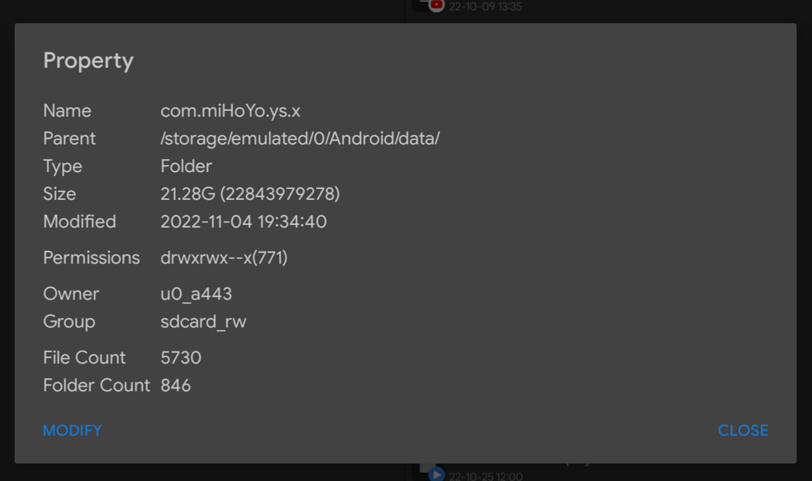
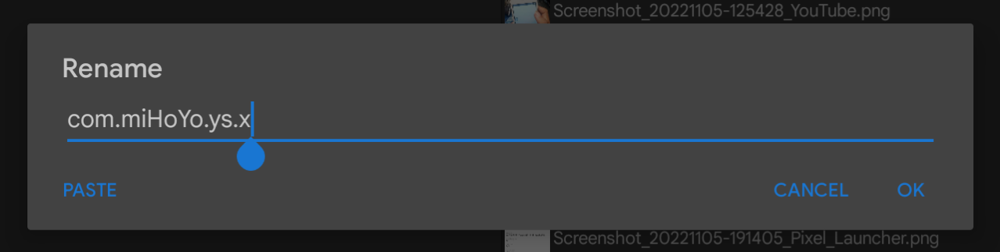
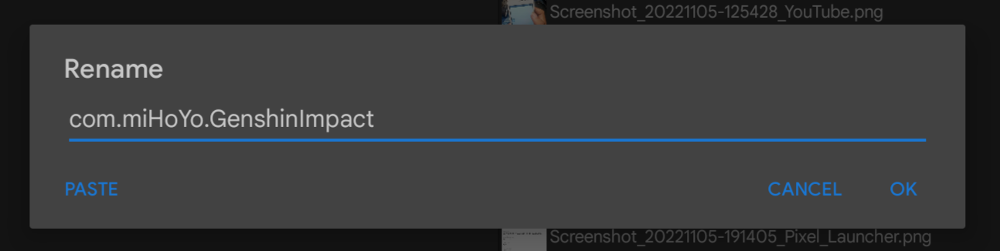

# Frequently Asked Questions (Android)

## 0% Preparing Load Data

1. Check the file for com.miHoYo.ys.x in Android/data\

2. If the size is lower than 18GB, you need to download some data in Official Server\
3. Rename back com.miHoYo.ys.x to com.miHoYo.GenshinImpact and open original apk from Play Store\
from : \
\
to : \

4. Login and download all Data there until u see the door\

5. If done then rename back com.miHoYo.GenshinImpact to com.miHoYo.ys.x
from : \
\
To : \

6. Click on Yuuki Server

> [Back to FAQ](/YuukiPS/docs/FAQ/README.MD)
